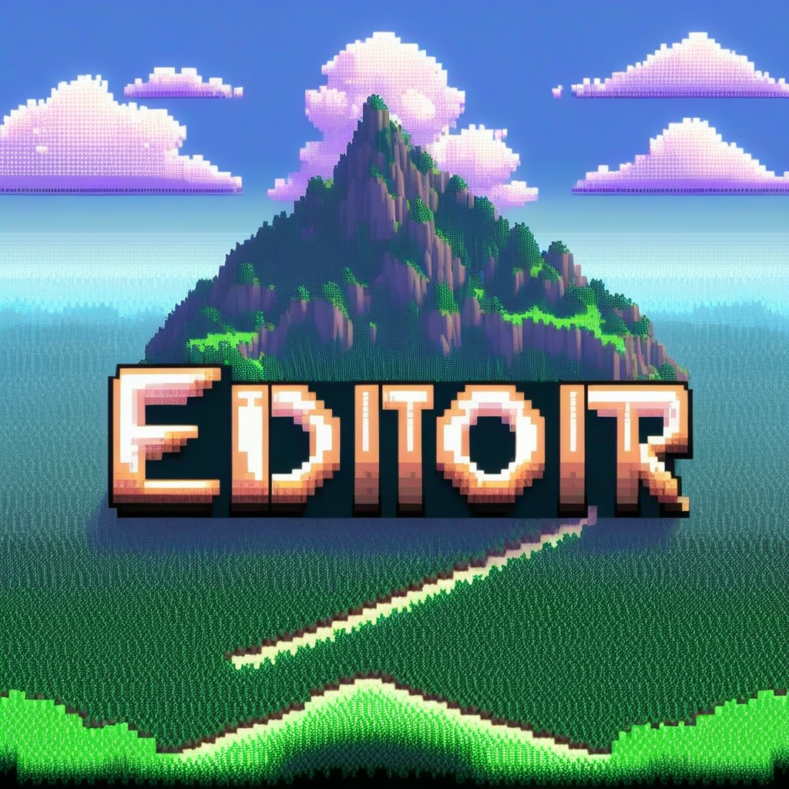
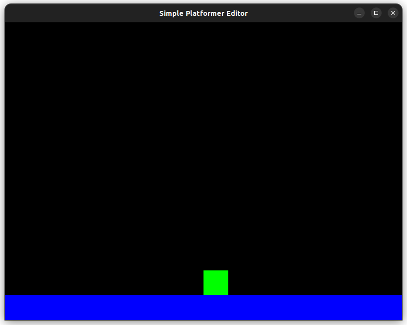
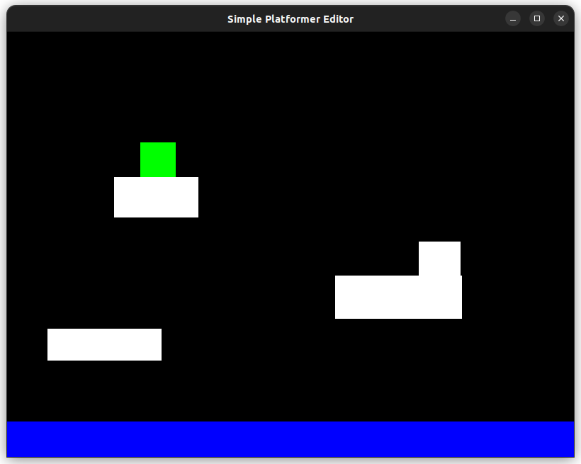

<p align="center">
	
</p>

<h1 align="center">Simple Platformer Editor</h1>

<p align="center">
	<strong>Just drag the mouse and create platforms with ease!</strong>
</p>

## 🚀 Overview

Welcome to the **Simple Platformer Editor**! This project allows you to create platforms in the game environment while you're playing as the player, so you can interact with the platforms as you're creating them. It's built with SFML and C++ to provide a smooth and efficient experience.

## 🎨 Features

- **Intuitive Interface:** Easy-to-use interface to create platforms.
- **Real-time Editing:** See your changes as you make them.

## 🛠️ Installation

To get started with the Simple Platformer Editor, follow these steps:

1. **Clone the Repository**
```sh
git clone https://github.com/321BadgerCode/simple_platformer_editor.git
cd ./simple_platformer_editor/
```

2. **Build the Project**
```sh
make
```

> [!NOTE]
> Running `make` will automatically run the program, but for future use, you can run the program with `make run`.
3. **Run the Editor**
```sh
make run
```

<details>

<summary>📦 Dependencies</summary>

- [SFML](https://www.sfml-dev.org/)

</details>

<details>

<summary>🔨 Building</summary>

Makefile commands:

|	Command		|	Description		|
|	:---:		|	:---:			|
|	`make`		|	Build & run the project	|
|	`make run`	|	Run the project		|
|	`make clean`	|	Clean the project	|

</details>

## 📸 Screenshots

<p align="center">
	
	
</p>

## 🎮 Playing

To play the game, use the following controls:

**Player Controls:**
- **Left Arrow:** Move left
- **Right Arrow:** Move right
- **Up Arrow:** Jump
---
**Editor Controls:**
- **Left Mouse Click & Drag:** Create platform

## 📝 License

[LICENSE](./LICENSE)